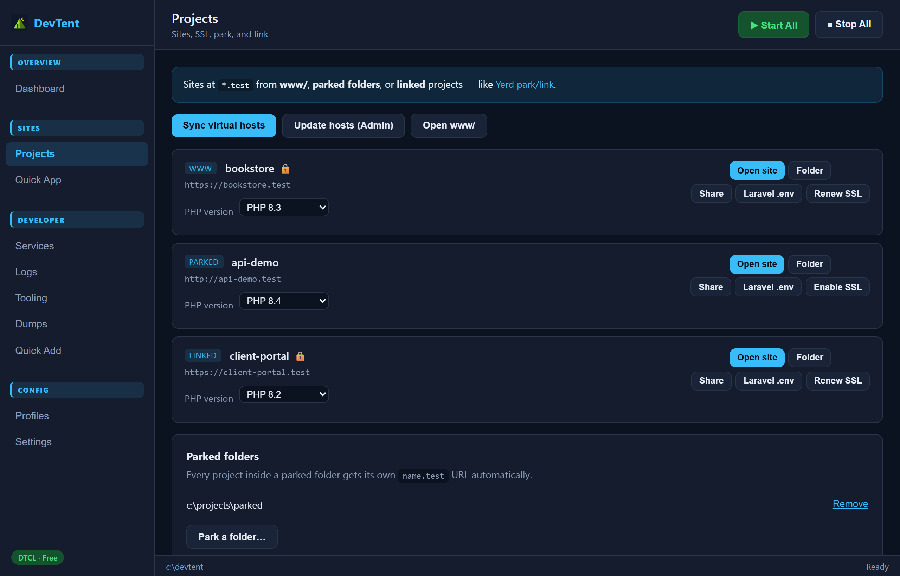
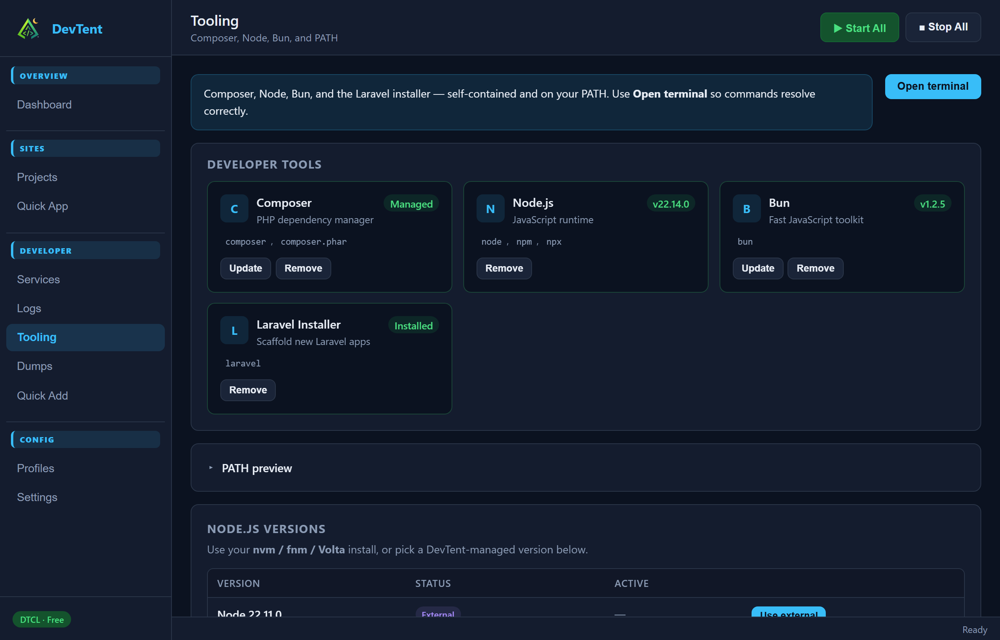
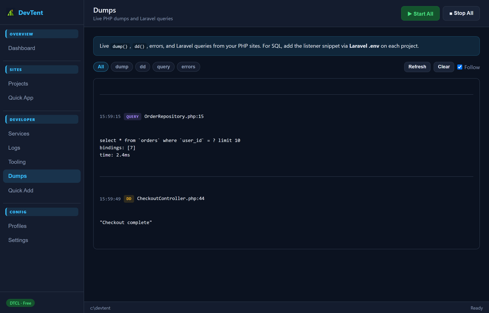
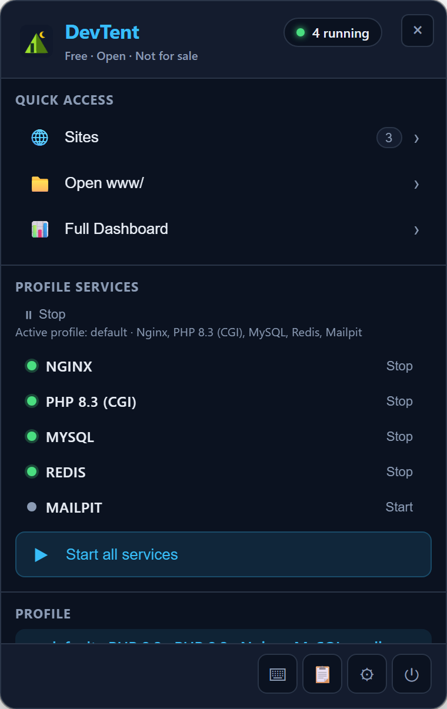

# DevTent

[CI](https://github.com/DubStepMad/devtent/actions/workflows/ci.yml)
[GitHub release](https://github.com/DubStepMad/devtent/releases/latest)
[License: DTCL v1.0](LICENSE)
[Platform](https://github.com/DubStepMad/devtent/releases/latest)
[Node.js](https://nodejs.org/)

**The free, open-source local dev environment — forever.**

DevTent is a portable local stack for PHP, Nginx, MySQL, and more — with profiles, pretty URLs (`*.localhost` / `*.test`), Quick Add runtimes, and a tray-first desktop app. It runs on **Windows, macOS, and Linux**, and is **fully open source** under DTCL v1.0: free to use, modify, and share, with no license keys and no selling the software.

> Built by developers, for developers. Fork it, extend it, ship features the community needs.


## Screenshots

Screenshots use **fictional demo data** (`bookstore.test`, `api-demo.test`, etc.) — not a real install.

| Dashboard | Projects |
| --- | --- |
| [](docs/screenshots/dashboard.png) | [](docs/screenshots/projects.png) |

| Services | Tooling |
| --- | --- |
| [](docs/screenshots/services.png) | [](docs/screenshots/tooling.png) |

| Dumps | Profiles |
| --- | --- |
| [](docs/screenshots/dumps.png) | [](docs/screenshots/profiles.png) |

| Tray quick panel |
| --- |
| [](docs/screenshots/tray.png) |

The **dashboard** is your home base — stack health, recent sites, and quick actions. **Projects** covers sites, per-site PHP, SSL, park/link, and share. Under **Developer** you get **Services**, **Logs**, **Tooling**, and live **Dumps**. **Profiles** switch your PHP / web server / database stack. The **tray quick panel** keeps start/stop and sites one click away.

Regenerate screenshots after UI changes:

```bash
npm run screenshots -w @devtent/desktop
```

## Why DevTent?

- **Own your stack** — one portable folder (`c:\devtent`); copy, back up, or move it anywhere
- **Free & open** — DTCL v1.0 copyleft; source stays open in derivatives
- **Just works on first run** — optional one-click **recommended stack** (PHP, Nginx, MySQL, mkcert) with services auto-started
- **Database peace of mind** — automatic MySQL backups before stop, daily while the app is open, 7-day retention
- **Modern full stack** — PostgreSQL, Redis, Mailpit, Node/Bun/Composer tooling, mkcert via Quick Add / Tooling
- **Park & link sites** — serve `www/`, parked folders, or external projects on `*.test`
- **Developer tooling** — Composer, Node, Bun, and Laravel installer in one **Tooling** tab
- **Environment doctor** — `devtent doctor --fix` and dashboard health checks with safe repairs
- **Pretty URLs** — `myapp.test` via auto virtual hosts + hosts file
- **Profiles** — switch PHP / stack configs from the UI
- **Import wizard** — copy projects, databases, and runtimes from an existing local environment
- **Tray + dashboard** — quick panel for day-to-day work

## How DevTent compares

DevTent sits in the same space as [Laravel Herd](https://herd.laravel.com/), [Yerd](https://yerd.app/), and [Lerd](https://lerd.dev/) — free and open source, with a portable folder you fully own. Started Windows-first; now ships installers for Windows, macOS, and Linux.

| | Herd | Yerd | Lerd | **DevTent** |
| --- | :---: | :---: | :---: | :---: |
| Windows | ✓ | ✗ | ✗ | **✓** |
| macOS | ✓ | ✓ | ✓ | **✓** |
| Linux | ✗ | ✓ | ✓ | **✓** |
| Open source | ✗ | ✓ | ✓ | **✓** |
| No containers | ✓ | ✓ | ✗ | **✓** |
| `doctor` health checks | ✗ | ✓ | ✗ | **✓** |
| DB + mail (no Pro paywall) | Pro | ✓ | ✓ | **✓** |
| Laravel live dumps | Pro | ✓ | ✓ | **✓** ([Dumps](docs/COMPARISON.md#using-new-features) tab) |
| Public tunnel / share | ✓ | ✓ | ✓ | **✓** (`devtent share <site>`) |
| PHP per site | ✓ | ✓ | ✓ | **✓** (per-site PHP dropdown) |

### Laravel dumps, share & per-site PHP

These ship in the desktop app and CLI — not on a roadmap.

**Laravel live dumps** — `dump()` / errors from any PHP site, plus Laravel telemetry (queries, jobs, views, requests, logs, cache, HTTP) via AppServiceProvider listeners. Quick App and `doctor --fix` install capture automatically. Open the **Dumps** tab (or use the CLI).

```bash
devtent dumps list          # tail dump log in the terminal
devtent dumps clear
```

**Public share** — Cloudflare quick tunnels for one-off demos, or **named tunnels** with a stable hostname (`devtent share login` first).

```bash
devtent share myapp              # quick tunnel; Ctrl+C to stop
devtent share named create demo
devtent share named configure demo --site myapp --hostname app.example.com
devtent share named start demo
```

**Local CA & DNS** — `devtent ssl ca` / Doctor trust mkcert; `devtent dns start` answers `*.{tld}` on port 15353 (macOS can install `/etc/resolver`).

**PHP per site** — each site can run a different PHP version (separate `php-cgi` on ports 9082, 9083, 9084…). Regenerates vhosts and Procfile automatically.

```bash
devtent sites php myapp php-8.4
devtent sites php myapp           # show current version
```

| MariaDB | ◐ | ✓ | ◐ | **✓** |

Full feature matrix, honest gaps, and roadmap: **[docs/COMPARISON.md](docs/COMPARISON.md)**.


### Custom services

Any other tool (Apache, Memcached, etc.) can be added via the **Procfile editor** in the tray panel once binaries are in `bin/`.

## Quick start


### Prerequisites

- [Node.js 20+](https://nodejs.org/) — developers building from source only
- Windows 10/11, macOS 12+ (Apple Silicon), or a modern Linux x64 desktop


### End users — installers

Download the installer for your OS from [GitHub Releases](https://github.com/DubStepMad/devtent/releases):

- **Windows:** `DevTent Setup x.y.z.exe`
- **macOS:** `DevTent-x.y.z-arm64.dmg`
- **Linux:** `DevTent-x.y.z-x64.AppImage` or `.deb`

> **Windows SmartScreen:** The Windows installer may be **unsigned**. The setup wizard explains what to do if Windows shows a warning (**More info → Run anyway**). See [docs/SIGNING.md](docs/SIGNING.md) for optional code signing.

On macOS/Linux, install **nginx** (and optionally **redis**) via your package manager before Quick Add if you use `downloadType: system` manifests (`brew install nginx`, `apt install nginx`).


### Developers — run from source

The DevTent window opens on first run for setup. After that, **look for the tent icon in your system tray** (bottom-right on Windows).

**Already have a local stack?** On setup or in **Settings → Import environment**, point DevTent at your existing environment folder. It can copy **www projects**, **php.ini**, **database data**, and **runtimes**. The source folder is **never modified or deleted**.

```bash
npm install
npm start
```

1. Click **Get Started** with **Install recommended stack** checked (default)
2. DevTent downloads PHP, Nginx, MySQL, and mkcert, enables services, and can start them for you
3. Use **Quick App** to create a project, then open `myapp.test` (run as Administrator once if hosts sync needs it)

If `*.test` URLs do not resolve after **Sync Virtual Hosts**, approve the **Administrator** prompt that DevTent opens (DevTent itself does not need admin).

**Updating:** Re-run the installer into the same folder (e.g. `p:\devtent`). The installer asks DevTent to quit automatically; if that fails, open Task Manager → **Details** → end **DevTent.exe**, then continue. Your `www/` and `data/` folders are left in place.

### Build the installer

```bash
# End DevTent.exe in Task Manager (Details tab) if it is running, then:
npm run dist
```

Output: `packages/desktop/release/DevTent Setup 1.3.0.exe`

### CLI (optional)

```bash
npm run devtent -- init
npm run devtent -- stack install
npm run devtent -- start
npm run devtent -- mysql backup
npm run devtent -- migrate import --from C:\\path\\to\\environment
```


## Project structure

```
devtent/                  # Your portable instance (after setup)
├── bin/                   # Downloaded runtimes (PHP, Nginx, MySQL, mkcert…)
├── etc/                   # Generated configs (nginx, ssl)
├── www/                   # Your projects → auto virtual hosts
├── data/                  # Database data directories
│   └── backups/mysql/     # Automatic MySQL dumps
├── logs/                  # Service logs
├── profiles/              # Stack profiles
└── devtent.toml          # Main configuration
```


## CLI reference

```bash
devtent init [path]              # Initialize at c:\devtent (or custom path)
devtent stack install            # PHP 8.3 + Nginx + MySQL + mkcert, enable services
devtent start [service...]       # Start all or specific services
devtent stop [service...]        # Stop services (backs up MySQL first)
devtent status                   # Show running services & URLs
devtent mysql backup             # Manual mysqldump (MySQL must be running)
devtent mysql list-backups       # List saved backups
devtent mysql restore <id>       # Restore from a backup
devtent open [view]              # Open desktop app (services, settings, …)
devtent health                   # Environment health summary
devtent export <dest>            # Export environment bundle
devtent import-bundle <folder>   # Import export bundle
devtent profile create <name> --redis --mailpit  # Optional profile services
devtent profile list             # List profiles
devtent profile use <name>       # Switch active profile
devtent vhost sync               # Regenerate virtual hosts from www/
devtent ssl enable <domain>      # Generate mkcert certificate
devtent quick-add list           # List installable runtimes
devtent quick-add <name>         # Install from manifests/
devtent quick-app <template>     # Scaffold a new project
devtent node list                  # List installable Node versions
devtent node install <version>     # Install Node (e.g. node-22)
devtent node use <version>         # Set active Node for profile
devtent sites link <path>       # Link external project
devtent sites php <name> <ver> # Per-site PHP (php-8.2, php-8.3, php-8.4)
devtent share <site>           # Public quick tunnel (Ctrl+C to stop)
devtent share named list       # Named Cloudflare tunnels
devtent dns status             # Local DNS for custom TLDs
devtent dumps list             # Live dump / Laravel telemetry
devtent doctor --fix           # Diagnose and repair environment
```

`migrate laragon` is a legacy alias for `migrate import`.

## Contributing

See [CONTRIBUTING.md](CONTRIBUTING.md). Security reports: [SECURITY.md](SECURITY.md).

## Changelog

See [CHANGELOG.md](CHANGELOG.md).

## License

DevTent is licensed under the **[DevTent Community License v1.0 (DTCL)](LICENSE)**.

- **Free forever** — use, modify, and share at no cost.
- **No sale, ever** — no paid downloads, subscriptions, or license keys.
- **No proprietary forks** — derivatives must release source under DTCL v1.0.

See [docs/LICENSE-FAQ.md](docs/LICENSE-FAQ.md) for a plain-language summary.

## Community

- [GitHub Issues](https://github.com/DubStepMad/devtent/issues)
- [GitHub Discussions](https://github.com/DubStepMad/devtent/discussions)
- [Releases](https://github.com/DubStepMad/devtent/releases)

