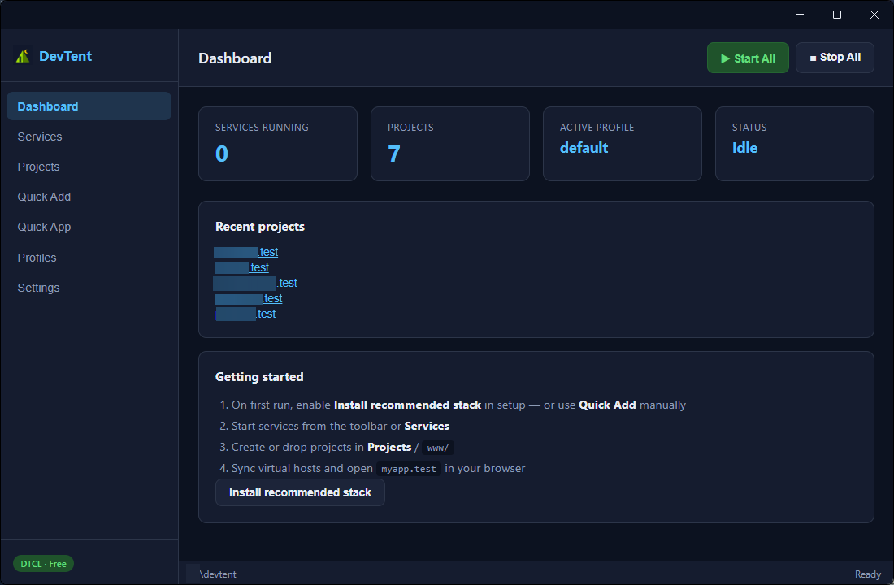
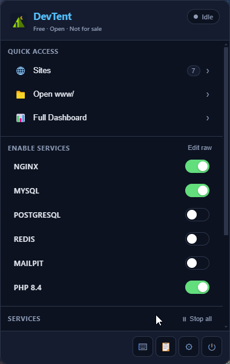
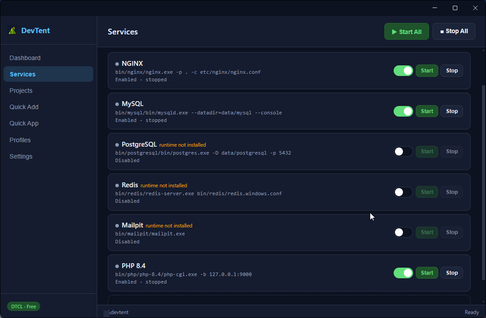
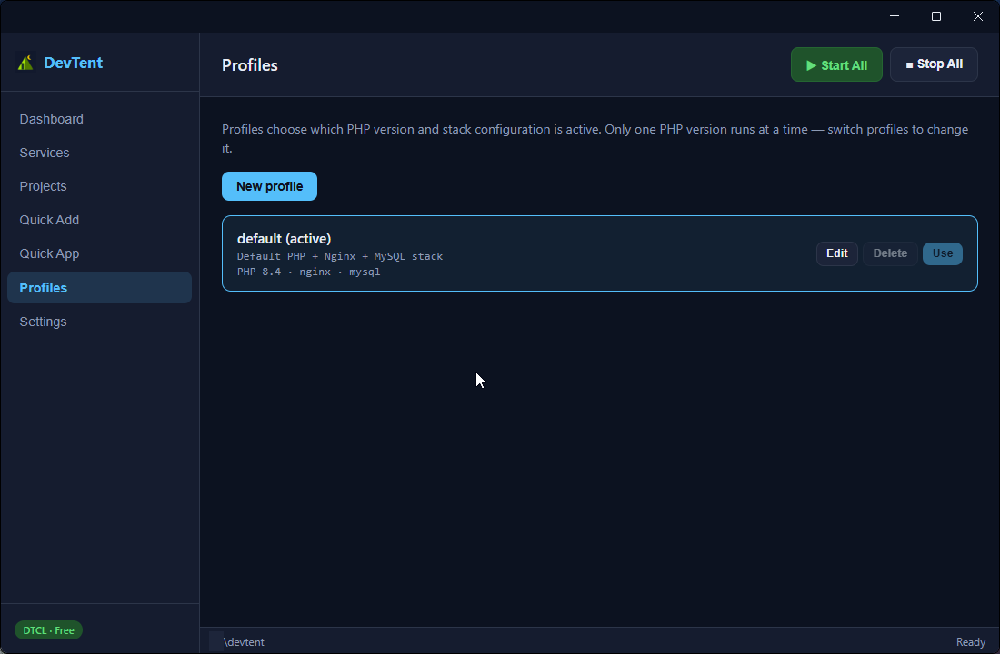

# DevTent

**The free, open-source local dev environment — forever.**

DevTent is a portable Windows stack for PHP, Nginx, MySQL, and more — with profiles, pretty URLs (`*.test`), Quick Add runtimes, and a tray-first desktop app. It is **fully open source** under DTCL v1.0: free to use, modify, and share, with no license keys and no selling the software.

> Built by developers, for developers. Fork it, extend it, ship features the community needs.

## Screenshots

| Dashboard | Tray quick panel |
| --- | --- |
|  |  |

| Services | Profiles |
| --- | --- |
|  |  |

The **dashboard** is your home base — projects, stack status, and getting started. The **tray quick panel** keeps start/stop, sites, and Procfile toggles one click away. **Services** and **Profiles** let you manage what runs and which PHP / web server / database stack is active.

## Why DevTent?

- **Own your stack** — one portable folder (`c:\devtent`); copy, back up, or move it anywhere
- **Free & open** — DTCL v1.0 copyleft; source stays open in derivatives
- **Just works on first run** — optional one-click **recommended stack** (PHP, Nginx, MySQL, mkcert) with services auto-started
- **Database peace of mind** — automatic MySQL backups before stop, daily while the app is open, 7-day retention
- **Modern full stack** — PostgreSQL, Redis, Mailpit, Node, mkcert via Quick Add
- **Pretty URLs** — `myapp.test` via auto virtual hosts + hosts file
- **Profiles** — switch PHP / stack configs from the UI
- **Import wizard** — copy projects, databases, and runtimes from an existing local environment
- **Tray + dashboard** — quick panel for day-to-day work

## Features (v1.0)

- **Recommended stack** — On setup, install PHP 8.3, Nginx, MySQL 8.4, and mkcert in one flow; enable services and start them automatically.
- **MySQL backups** — `mysqldump` before MySQL stops; daily scheduled backups; manual backup in Settings; stored under `data/backups/mysql/` (7-day retention).
- **Portable & isolated** — Everything lives in one folder. Copy it to a USB drive or another machine.
- **Profile system** — Switch between PHP 8.2 / 8.3 / 8.4 stacks from the UI.
- **Service orchestration** — Start/stop **Nginx, MySQL, PHP, PostgreSQL, Redis, and Mailpit** via Quick Add + Procfile toggles; add any custom command.
- **Auto virtual hosts** — Drop a project in `www/` and get `myapp.test` automatically. On Windows, DevTent opens an elevated CMD prompt to update the hosts file when needed (the app itself stays non-admin).
- **SSL with mkcert** — Install mkcert via Quick Add, then enable HTTPS per domain.
- **Quick Add** — PHP 8.2–8.4, Nginx, MySQL 8.4, Node 22, mkcert, Redis, Mailpit, PostgreSQL 16 (one click each).
- **Quick App** — Scaffold Laravel or plain PHP projects from the dashboard.
- **Environment import** — Copy `www/` projects, php.ini, database files, and runtimes from a folder you already use (source folder is read-only; nothing is deleted).
- **Tray-first UX** — Quick panel + full dashboard.
- **Windows installer** — NSIS `.exe` with Start Menu shortcut and tray integration.

### Custom services

Any other tool (Apache, Memcached, etc.) can be added via the **Procfile editor** in the tray panel once binaries are in `bin/`.

## Quick start

### Prerequisites

- [Node.js 20+](https://nodejs.org/) — developers building from source only
- Windows 10/11 (v1.0 target platform)

### End users — Windows installer

Download **DevTent Setup 1.0.0.exe** from [GitHub Releases](https://github.com/DubStepMad/devtent/releases).

> **SmartScreen notice:** The installer is **unsigned** in v1.0. The setup wizard explains what to do if Windows shows a warning (**More info → Run anyway**). See [docs/SIGNING.md](docs/SIGNING.md) for optional code signing.

### Developers — run from source

The DevTent window opens on first run for setup. After that, **look for the tent icon in your system tray** (bottom-right on Windows).

**Already have a local stack?** On setup or in **Settings → Import environment**, point DevTent at your existing environment folder. It can copy **www projects**, **php.ini**, **database data**, and **runtimes**. The source folder is **never modified or deleted**.

```bash
npm install
npm start
```

1. Click **Get Started** with **Install recommended stack** checked (default)
2. DevTent downloads PHP, Nginx, MySQL, and mkcert, enables services, and can start them for you
3. Use **Quick App** to create a project, then open `myapp.test` (run as Administrator once if hosts sync needs it)

If `*.test` URLs do not resolve after **Sync Virtual Hosts**, approve the **Administrator** prompt that DevTent opens (DevTent itself does not need admin).

**Updating:** Re-run the installer into the same folder (e.g. `p:\devtent`). The installer asks DevTent to quit automatically; if that fails, open Task Manager → **Details** → end **DevTent.exe**, then continue. Your `www/` and `data/` folders are left in place.

### Build the installer

```bash
# End DevTent.exe in Task Manager (Details tab) if it is running, then:
npm run dist
```

Output: `packages/desktop/release/DevTent Setup 1.0.0.exe`

### CLI (optional)

```bash
npm run devtent -- init
npm run devtent -- stack install
npm run devtent -- start
npm run devtent -- mysql backup
npm run devtent -- migrate import --from C:\\path\\to\\environment
```

## Project structure

```
devtent/                  # Your portable instance (after setup)
├── bin/                   # Downloaded runtimes (PHP, Nginx, MySQL, mkcert…)
├── etc/                   # Generated configs (nginx, ssl)
├── www/                   # Your projects → auto virtual hosts
├── data/                  # Database data directories
│   └── backups/mysql/     # Automatic MySQL dumps
├── logs/                  # Service logs
├── profiles/              # Stack profiles
└── devtent.toml          # Main configuration
```

## CLI reference

```bash
devtent init [path]              # Initialize at c:\devtent (or custom path)
devtent stack install            # PHP 8.3 + Nginx + MySQL + mkcert, enable services
devtent start [service...]       # Start all or specific services
devtent stop [service...]        # Stop services (backs up MySQL first)
devtent status                   # Show running services & URLs
devtent mysql backup             # Manual mysqldump (MySQL must be running)
devtent mysql list-backups       # List saved backups
devtent profile list             # List profiles
devtent profile use <name>       # Switch active profile
devtent vhost sync               # Regenerate virtual hosts from www/
devtent ssl enable <domain>      # Generate mkcert certificate
devtent quick-add list           # List installable runtimes
devtent quick-add <name>         # Install from manifests/
devtent quick-app <template>     # Scaffold a new project
devtent migrate import --from <path>   # Import from existing environment folder
```

`migrate laragon` is a legacy alias for `migrate import`.

## Contributing

See [CONTRIBUTING.md](CONTRIBUTING.md). Security reports: [SECURITY.md](SECURITY.md).

## Changelog

See [CHANGELOG.md](CHANGELOG.md).

## License

DevTent is licensed under the **[DevTent Community License v1.0 (DTCL)](LICENSE)**.

- **Free forever** — use, modify, and share at no cost.
- **No sale, ever** — no paid downloads, subscriptions, or license keys.
- **No proprietary forks** — derivatives must release source under DTCL v1.0.

See [docs/LICENSE-FAQ.md](docs/LICENSE-FAQ.md) for a plain-language summary.

## Community

- [GitHub Issues](https://github.com/DubStepMad/devtent/issues)
- [GitHub Discussions](https://github.com/DubStepMad/devtent/discussions)
- [Releases](https://github.com/DubStepMad/devtent/releases)
