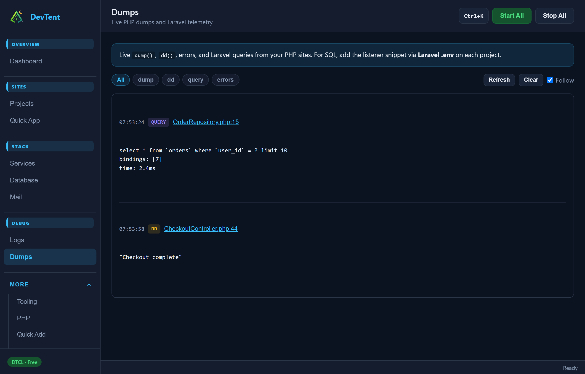

# Debugging

## Logs

**Debug → Logs** tails service logs, site access/error logs, and app diagnostics. Use search, follow mode, and **Open logs/** for the folder on disk.

## Dumps



**Debug → Dumps** shows live `dump()` / errors from PHP sites, plus Laravel telemetry (queries, jobs, views, requests, logs, cache, outbound HTTP) when capture is installed.

- Quick App Laravel projects install capture automatically
- Or use **Doctor → Run safe fixes**, or the site drawer **Install telemetry**
- Filter by type / site; clear dumps when done

CLI:

```bash
devtent dumps list
devtent dumps clear
```

## Mail

**Stack → Mail** controls **Mailpit**. Point Laravel at:

```env
MAIL_MAILER=smtp
MAIL_HOST=127.0.0.1
MAIL_PORT=1025
MAIL_USERNAME=null
MAIL_PASSWORD=null
MAIL_ENCRYPTION=null
```

Open the Mailpit UI from the page (or tray) once the service is running.

## Doctor

**System → Doctor** runs the same checks as `devtent doctor`:

- Re-check environment health
- **Run safe fixes** (sync Procfile, regenerate vhosts, verify configs, rewrite `devtent-path` / `my.ini` / `php.ini` for portable Windows paths)
- Trust mkcert CA
- Start/stop local DNS and install the OS resolver for custom TLDs

Fix issues here before digging through raw logs.

Next: **[Database](Database.md)**
