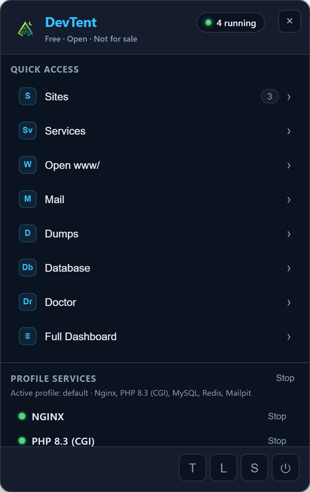

# Getting Started

## Install

1. Download the installer for your OS from [GitHub Releases](https://github.com/DubStepMad/devtent/releases/latest):
   - **Windows:** `DevTent Setup x.y.z.exe`
   - **macOS:** `DevTent-x.y.z-arm64.dmg` or `…-x64.dmg`
   - **Linux:** AppImage or `.deb` (x64 / arm64)
2. Run the installer. On Windows, if SmartScreen warns about an unsigned app, choose **More info → Run anyway** (OSS builds may be unsigned — see [SIGNING.md](https://github.com/DubStepMad/devtent/blob/main/docs/SIGNING.md)).

## First-run setup

On first launch DevTent opens a short setup card:

1. Leave **Install recommended stack** checked (PHP 8.3, Nginx, MySQL, mkcert).
2. Leave **Start services after setup** checked if you want the stack running immediately.
3. Click **Get Started**.

DevTent creates its portable root (for example `c:\devtent` on Windows) and downloads runtimes into `bin/`. No folder picker is required.

> **Coming from Laragon or another stack?** Finish setup first, then use **Settings → Transfer → Import environment**. The source folder is never modified.

## Tray-first workflow

After setup, look for the **tent icon** in the system tray (notification area). Click it for the quick panel:



From the tray you can:

- Start / stop profile services
- Open sites, Mail, Dumps, Database, Doctor
- Switch profiles
- Open the full dashboard

## Open the dashboard

Use **Full Dashboard** in the tray, or run:

```bash
devtent open
```


The dashboard shows stack health, sites you’re serving, and shortcuts (**New site**, **Services**, **Database**, **Logs**, **Doctor**).

## Create your first site

1. Open **Quick App** (sidebar → Sites, or dashboard **New site**).
2. Pick a template (Laravel, WordPress, plain PHP, …) and a project name.
3. Click **Create Project**.
4. Open `https://yourname.localhost` (default) — no hosts-file admin needed.

Prefer `.test` domains? Switch under **Settings → General → Domain suffix**, then **Projects → Sync virtual hosts** (and approve the admin hosts prompt once if needed).

## Keyboard shortcuts

| Key | Action |
| --- | --- |
| `Ctrl+K` / `⌘K` | Command palette |
| `1`–`9` | Jump primary views (Dashboard → … → Settings) |
| `S` | Start all services |
| `R` | Refresh |
| `D` | Open Doctor |
| `/` | Command palette |

Next: **[Sites & Projects](Sites-and-Projects.md)**
