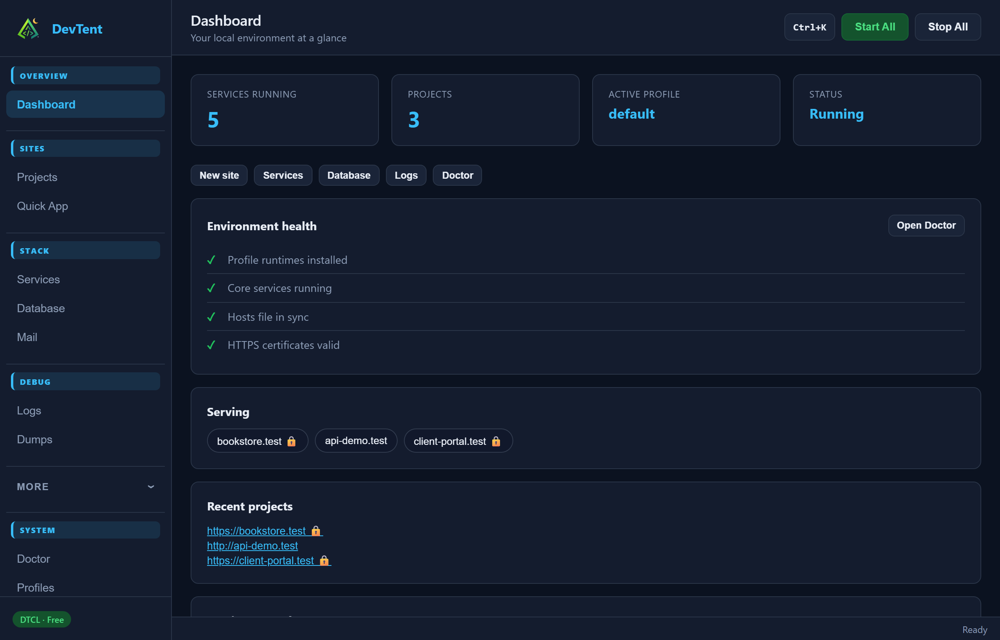

# DevTent user guide

**The free, open-source local PHP / Laravel stack** — portable folder, tray-first desktop app, pretty URLs, and no license keys.

> Also published on the [GitHub Wiki](https://github.com/DubStepMad/devtent/wiki) once the first wiki page is created.

## Start here

1. **[Getting Started](Getting-Started.md)** — install, first-run setup, tray icon
2. **[Sites & Projects](Sites-and-Projects.md)** — `www/`, Quick App, park / link, SSL
3. **[Services & Profiles](Services-and-Profiles.md)** — start/stop stack, profiles, Quick Add
4. **[Debugging](Debugging.md)** — Logs, Dumps, Mail, Doctor
5. **[Database](Database.md)** — create DBs and backups
6. **[Share](Share.md)** — Cloudflare quick & named tunnels
7. **[Settings](Settings.md)** — domains, import, updates
8. **[CLI](CLI.md)** — terminal commands
9. **[MCP / AI agents](MCP.md)** — Cursor, Claude Code, and friends

## What DevTent is

DevTent keeps your whole local environment in one folder (for example `c:\devtent` or `/Users/you/devtent`):

| Path | Purpose |
| --- | --- |
| `www/` | Drop projects here → `myapp.localhost` |
| `bin/` | PHP, Nginx, MySQL, and other runtimes |
| `etc/` | Generated configs (nginx, SSL, …) |
| `data/` | Database data + automatic backups |
| `profiles/` | Named stacks (PHP version, web server, DB) |
| `logs/` | Service and site logs |

Day-to-day you mostly use the **system tray** quick panel. Open the **full dashboard** when you need Projects, Doctor, Settings, or deeper tooling.

## Platforms

Windows, macOS (Apple Silicon & Intel), and Linux (x64 & arm64). Download installers from [Releases](https://github.com/DubStepMad/devtent/releases/latest).

## License

[DTCL v1.0](https://github.com/DubStepMad/devtent/blob/main/LICENSE) — free forever, not for sale. See the [License FAQ](https://github.com/DubStepMad/devtent/blob/main/docs/LICENSE-FAQ.md).
