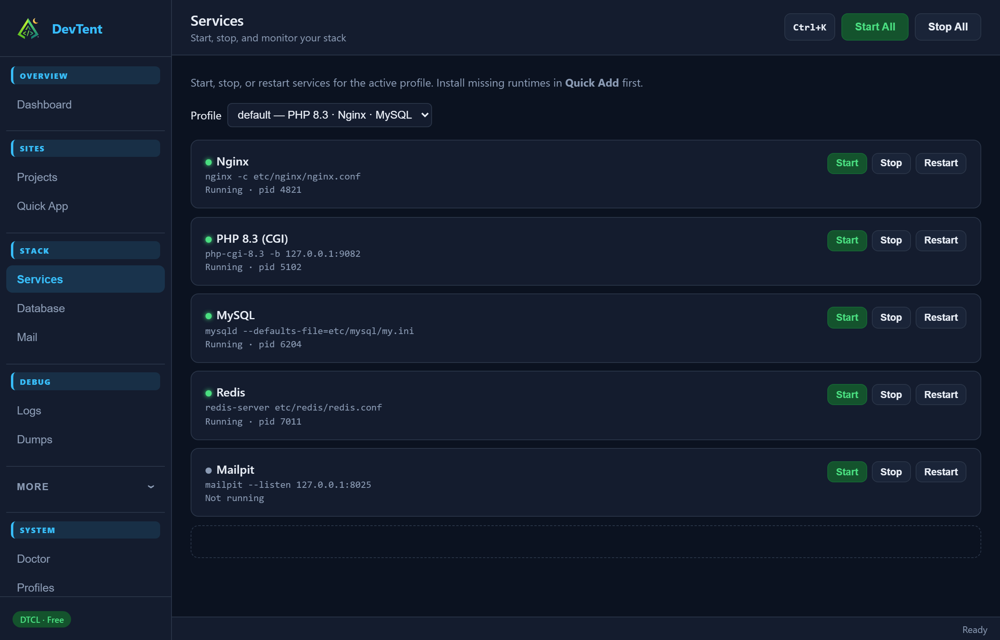
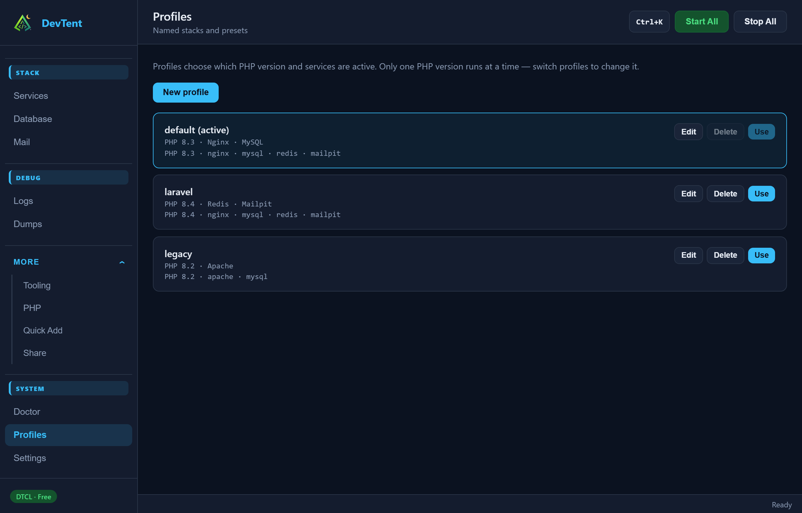
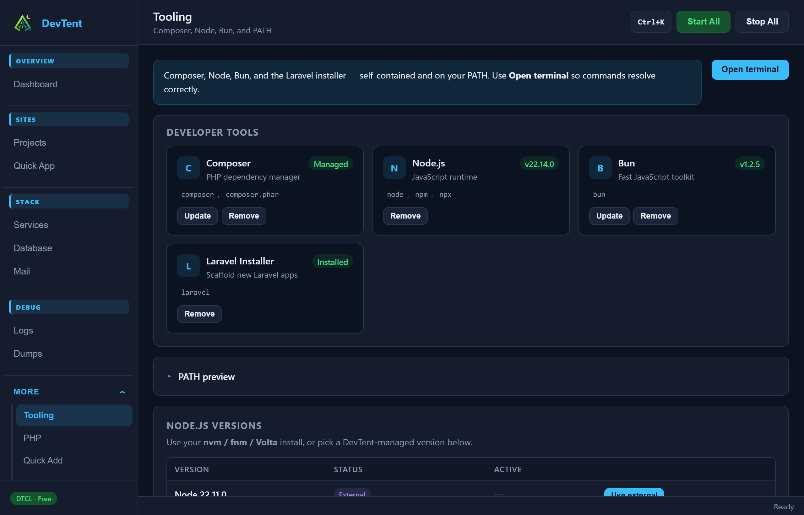

# Services & Profiles

## Services

**Stack → Services** lists everything in the **active profile** (Nginx/Apache, PHP-CGI/FPM, MySQL/MariaDB/PostgreSQL, Redis, Mailpit, …).

- **Start / Stop / Restart** per service
- Switch profile from the dropdown at the top (running services not in the new profile are stopped)
- Missing runtimes? Install them in **More → Quick Add**

Global **Start All** / **Stop All** live in the dashboard top bar and the tray.

## Profiles

A **profile** is a named stack: default PHP version, web server, database engine, and optional services (Redis, Mailpit, Meilisearch, MinIO, …).

1. Open **System → Profiles**
2. **New profile** or edit an existing one
3. Click **Use** to switch (confirm if services will stop)

Per-site PHP on **Projects** still overrides the profile default for that one site.

## Quick Add

**More → Quick Add** installs portable runtimes into `bin/` from manifests (PHP versions, Nginx, MySQL, Redis, Mailpit, mkcert, Node, …).

On macOS/Linux, some packages can be **copied from Homebrew/apt** into the portable tree so DevTent stays self-contained.

## Tooling

**More → Tooling** manages Composer, Node, Bun, and the Laravel installer, plus PATH preview. Always open a **DevTent terminal** so bundled binaries take precedence over copies on your system `PATH`. Per-project **Terminal** on **Projects** uses that site’s PHP version.

Next: **[Debugging](Debugging.md)**
