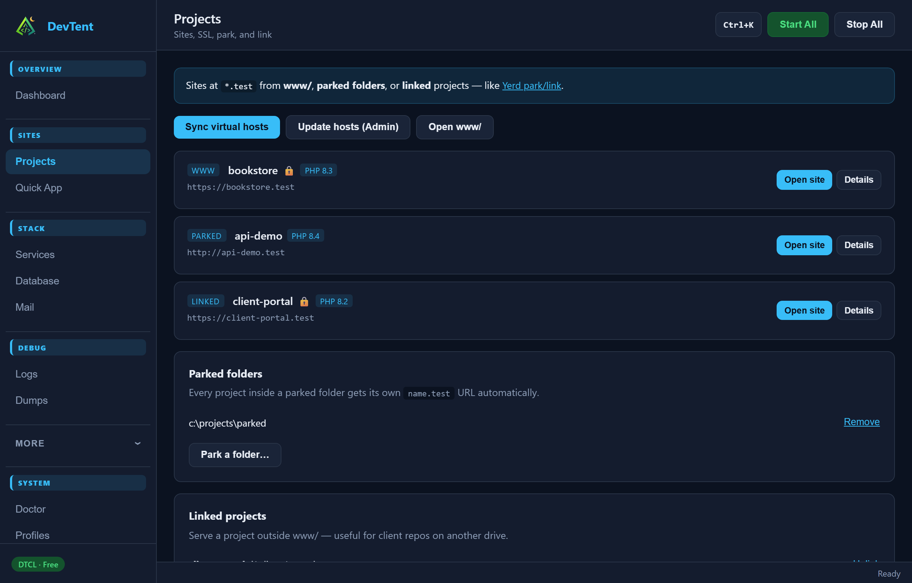

# Sites & Projects

## How sites appear

DevTent serves:

| Source | How you add it | Example URL |
| --- | --- | --- |
| **www/** | Drop a folder into `www/` | `myapp.localhost` |
| **Parked** | **Projects → Park a folder…** | each subfolder becomes a site |
| **Linked** | **Projects → Link project…** | external path with a chosen name |
| **Quick App** | Scaffold into `www/` | created for you |

Then click **Sync virtual hosts** so Nginx/Apache configs match.

## Quick App

**Sites → Quick App** scaffolds Laravel, WordPress, plain PHP, and more into `www/`. Laravel projects get dump/telemetry hooks for the **Dumps** tab automatically.

## Site details drawer

On **Projects**, open **Details** on a site to:

- Open the URL or project folder
- Choose **PHP version** (multiple versions can run side by side)
- Toggle **SSL** (mkcert)
- Start/stop **queue / scheduler / Vite** workers
- Install Laravel telemetry
- Create a matching database
- Share the site publicly

## SSL (HTTPS)

1. Install **mkcert** via **More → Quick Add** (included in the recommended stack).
2. In Doctor or the site drawer, **Trust local CA** once per machine.
3. Enable SSL on the site — URL becomes `https://…`.

## Domains: `.localhost` vs `.test`

| Suffix | Admin? | Notes |
| --- | --- | --- |
| `.localhost` (default) | No | Resolves in Chrome / Edge without hosts edits |
| `.test` | Yes (once) | Classic Herd/Laragon style; use **Update hosts (Admin)** |

Change this in **Settings → General**.

## Park & link tips

- **Park** a parent folder that contains many apps (each child folder = one site).
- **Link** a single project that must stay outside the DevTent tree (client repos, etc.).

Next: **[Services & Profiles](Services-and-Profiles.md)**
